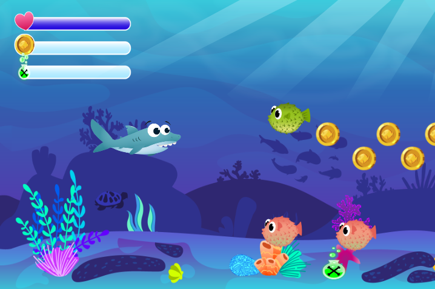

# 🦈 Sharkie

A classic side-scrolling jump’n’run game built with JavaScript and HTML5 Canvas.

## 🎮 Description
Control Sharkie using your keyboard to collect coins, defeat enemies, and survive underwater levels.

## 🛠️ Technologies
- HTML5
- CSS3
- JavaScript (OOP)
- HTML5 Canvas API

## 🚀 Start the Game
Open `index.html` in your browser. No build step needed.

## 📸 Screenshot
Image file: `img/sharkie.png`
